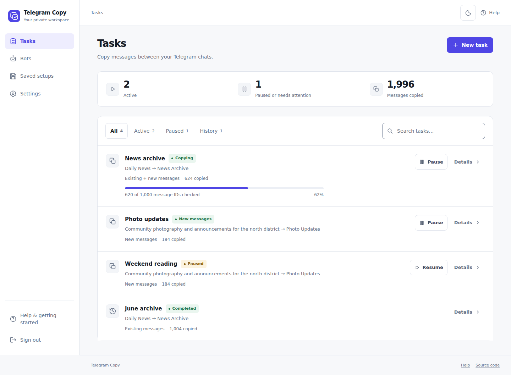

# Telegram Clone Worker

Copy messages between Telegram channels and groups from a private web dashboard. Runs on Cloudflare Workers with one D1 database. No separate server, paid API, or required environment variables.

This fork keeps the original copying workflow and rebuilds the interface, account protection, and database initialization.

## Preview

The screenshots use example data. Your dashboard starts empty.



[Phone layout](docs/images/dashboard_mobile.png) · [Dark mode](docs/images/dashboard_dark.png) · [Task details](docs/images/task_detail.png)

## Deploy

The repository already includes this D1 binding in `wrangler.jsonc`:

```json
{
  "binding": "DB",
  "database_name": "telegram-clone-worker-db",
  "database_id": "1b41441c-10d3-40fb-beba-08d8ab194fb5"
}
```

1. In Cloudflare, create a Worker connected to this repository.
2. Use `npm run build` as the build command and `npx wrangler deploy` as the deploy command. Leave the root directory at the repository root.
3. Make sure the D1 database above belongs to the same Cloudflare account. If you fork this repository to another account, create your own D1 database and replace its ID.
4. Deploy and open the Worker URL. Tables and required schema additions are created automatically.
5. Complete the one-time account setup below.

The minute-by-minute schedule is included in Wrangler. Copying continues when the browser is closed. Cloudflare and Telegram limits still apply; throughput depends on your bot, destination, and account plan.

## First sign-in

The dashboard stays locked until you create its password. There is no public access mode.

On the first visit, the Worker creates a private setup code. To retrieve it, open **Cloudflare → Storage & databases → D1 → telegram-clone-worker-db → Console** and run:

```sql
SELECT value FROM app_settings WHERE key = 'setup_code';
```

Paste the result into the setup page and choose a password of at least 12 characters. The code is removed after setup. This proves that the person creating the account owns the database; knowing the public website address is not enough.

An existing `ADMIN_PASSWORD` secret continues to work. It is optional. Existing passwords stored by earlier versions also remain usable. Browser sessions from the old version require signing in again.

## Start copying

1. Choose **New task** and connect a Telegram bot using its token from [BotFather](https://t.me/BotFather).
2. Add that bot to both chats. For a destination channel, give it permission to post messages.
3. Enter the source and destination using their usernames, chat IDs, or supported Telegram links, then check access.
4. Choose what to copy: new messages, message history, or both.
5. Review and start the task. Progress and any problems appear in the task details.

Use a dedicated bot for this app. Telegram allows only one update consumer for a bot; another app using its webhook or polling can prevent live copying. This app does not silently disconnect another service. Any disconnect action requires an explicit choice.

### History and filters

- A message range copies the IDs between the start and end. Deleted, service, or otherwise uncopyable messages may be skipped by Telegram.
- The recent-message option finds the latest ID by briefly posting a probe in the source, then deleting it. It needs posting and deletion rights. If cleanup fails, remove the probe manually. The selected number is an ID window, not a guarantee of that many surviving posts.
- Message-type and size filters apply to **new incoming messages**. Telegram's Bot API does not provide arbitrary historical message metadata, so those filters cannot reliably filter a history range.
- Content protected against copying cannot be copied through the Bot API.
- [Telegram normally keeps pending bot updates](https://core.telegram.org/bots/api#getting-updates) for no more than 24 hours. A long outage can leave a gap in live copying; use a known history range to recover it.
- Sending to Telegram and saving progress in D1 are separate operations. A crash between them can cause a repeat. Exactly-once delivery is not promised.

## A simpler workspace

Use **Tasks** to see all copying jobs, or switch to Active, Paused, and History. Each task has a clear status and a direct Details button. On phones, Tasks, Bots, Saved, and Settings are always available in the bottom navigation.

Task setup walks through choosing a bot, checking both chats, choosing messages, and reviewing before copying starts. Optional message-type and size filters are under **More options**. There is no file-extension picker; old extension selections no longer restrict copying.

## Display and settings

The app uses one layout with **Light**, **Dark**, or **Follow device** appearance. Use the button in the top bar to switch between light and dark, or select a mode in Settings. Icons, logos, forms, status messages, and dialogs use the same mode.

Your display choice is saved in D1 and restored after sign-in, including on another device. The signed-out page follows the device’s light/dark preference. Old theme selections are ignored.

Settings also offers larger text, reduced motion, spacing, task totals, and starting choices for new tasks. Less-used options are collapsed. Password changes and sign-out are in Account access. Existing tasks keep their settings when you change task defaults.

Help has a short getting-started guide and practical questions in plain language. All app icons and the logo live in [`src/assets`](src/assets); the app uses local SVGs and system fonts.

## Security

- Protected API routes stay locked before setup and require a valid session afterward.
- Session cookies are HttpOnly and SameSite; production cookies are Secure. Session tokens are not stored in browser local storage.
- Passwords are hashed with PBKDF2. Login and setup attempts are rate limited in D1.
- Password changes revoke existing sessions. Sign-out invalidates the current session.
- Mutating browser requests require the app's origin and JSON content type.
- Bot tokens remain server-side after they are saved. Saved configurations do not return them to the browser.
- Failed database initialization returns an error instead of opening access.

Bot tokens are stored in the private D1 database. Anyone with database administration access can read them. Keep your Cloudflare account and database exports private. The database ID in Wrangler identifies a resource; it is not an access credential.

This is a single-owner dashboard, not a multi-user service. Do not share the admin password with untrusted users.

## Local development

Use Node.js 24 and npm:

```bash
npm ci
npm run dev
```

Open the local address printed by Vite. The Cloudflare Vite plugin runs the Worker and a local D1 database. Production data is not used.

To retrieve a local setup code after opening the app:

```bash
npx wrangler d1 execute telegram-clone-worker-db --local --command "SELECT value FROM app_settings WHERE key = 'setup_code';"
```

| Command             | Purpose                                                 |
| ------------------- | ------------------------------------------------------- |
| `npm run dev`       | Run the app with the local Workers runtime and D1       |
| `npm run typecheck` | Check client and Worker TypeScript                      |
| `npm test`          | Run authentication, copying, and input regression tests |
| `npm run build`     | Build the Worker and browser assets                     |
| `npm run check`     | Run type checks, tests, and the production build        |
| `npm run deploy`    | Build and deploy with Wrangler                          |

Historical SQL files remain in `migrations/` for reference. The app performs additive schema checks automatically. Do not replay historical migrations over an already bootstrapped database: older migrations include table rebuilds and removed features.

See [verification notes](docs/VERIFICATION.md) for the checks performed and the remaining live-service checks.

## Updating

Push changes to the connected repository and let Cloudflare rebuild it. For manual deployment, run `npm run deploy`. Existing bots, tasks, progress, and saved configurations stay in D1.

Before a major update, take a D1 export or confirm that your account's database recovery is available. Never commit an export containing bot tokens or account settings.

## Project layout

```text
src/assets/       SVG icons and logo
src/client/       React interface and display preferences
src/auth/         Passwords, sessions, and request protection
src/db/           D1 initialization and queries
src/routes/api/   Bots, chats, tasks, and saved configurations
src/jobs/         Scheduled copying and live update processing
src/telegram/     Telegram Bot API client
src/shared/       Shared types and message filtering
```

## Credits

Original project by [iamLiquidX](https://github.com/iamLiquidX/telegram-clone-worker). Maintained in [vigarepo2/telegram-clone-worker](https://github.com/vigarepo2/telegram-clone-worker). Released under the [MIT license](LICENSE).
